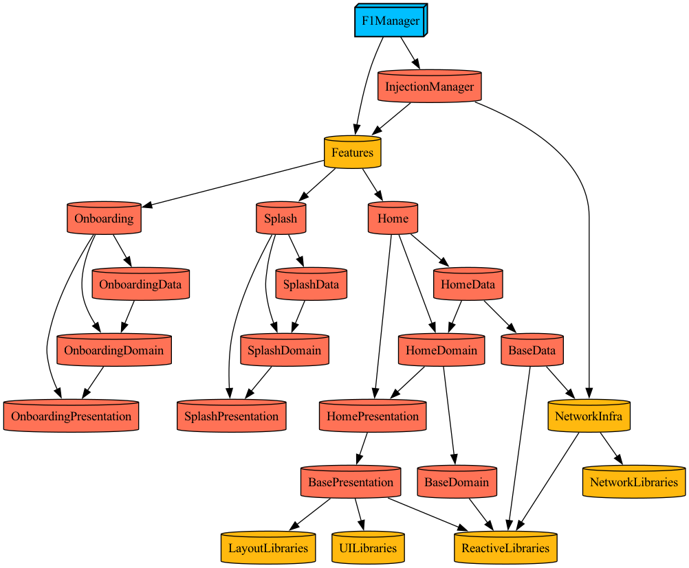

# F1

# Tuist Graph

# 문서

* [CLAUDE.md](CLAUDE.md)
* [PRD.md](PRD.md)

# 예정 작업

* RestAPI 서버 작업 (Node 혹은 FastAPI(Python))
  * 오픈소스 API 통합 작업
    * https://api.openf1.org/v1
    * http://api.jolpi.ca/ergast/f1
  * 이미지 저장
    * Drivers, Constructors, Cars
  * 앱 내 BaseURL 수정
    * TargetType, NetworkType 등 네트워크 관련 객체 변경 필요